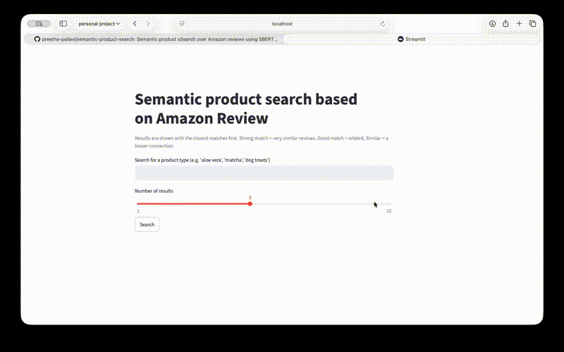

# Semantic Product Search

A search tool that finds Amazon products based on what reviewers actually said about them, not just keyword matching. Built with sentence embeddings, FAISS vector search, FastAPI, and Streamlit.

## Demo



## Why this project

Traditional product search relies on exact keyword matches, which misses a lot of useful information buried in customer reviews. This project explores whether review text alone, without any product titles or catalog metadata, can be used to build a working search and recommendation system.

It's useful as a proof of concept for teams that have rich unstructured text (reviews, support tickets, feedback forms) but limited structured product data. Rather than training a model from scratch, this project shows how far you can get by combining existing pretrained models (for embeddings) with a lightweight retrieval setup (FAISS), then wrapping the whole thing in a usable API and interface.

## What it does

Instead of matching exact keywords, this app understands what people actually wrote in product reviews. Search "aloe vera" and it surfaces products whose reviews describe aloe-related content, even when the word "aloe" doesn't appear anywhere in the product listing itself.

**Example:** searching "matcha" returns matcha teas, matcha-flavored candy, and related products, ranked by how closely their reviews match the query.

## Dataset

[Amazon Fine Food Reviews](https://www.kaggle.com/datasets/snap/amazon-fine-food-reviews): roughly 568K reviews across 74K products. After cleaning (deduplication, filtering low-signal products and reviews), the working dataset is about 342K reviews across 27.6K products.

## How it works

1. **Clean the data.** Remove duplicate reviews, drop products with too few reviews, strip HTML artifacts.
2. **Generate embeddings.** Each review is converted into a vector using `sentence-transformers` (`all-MiniLM-L6-v2`), then averaged per product.
3. **Build a search index.** All product vectors are indexed with FAISS for fast similarity search.
4. **Serve it.** A FastAPI backend exposes search and recommendation endpoints; a Streamlit app provides the interface.

## FAISS index

The project uses `product_index.faiss` as the precomputed FAISS vector index for semantic product search. It holds the product-level embeddings generated from the review data and is loaded by the FastAPI backend at startup, so it's required for the API to run.

This index is built in `notebooks/embedding.ipynb` and saved as `product_index.faiss`, so the app doesn't need to regenerate embeddings every time it starts.

## Match quality

Instead of showing raw similarity scores, results are grouped into three simple tiers:

- **Strong match**: very similar reviews
- **Good match**: related, but less precise
- **Similar**: a looser connection

This makes results easier to interpret without needing to understand the underlying similarity metric.

## Notebooks

| Notebook | What it does |
|---|---|
| `notebooks/EDA.ipynb` | Loads the raw dataset, inspects nulls, duplicates, and distributions, cleans it (dedupe, filter low-review products, strip HTML), saves the cleaned dataset as Parquet |
| `notebooks/embedding.ipynb` | Generates review embeddings, aggregates them per product, builds and saves the FAISS index, evaluates recommendation quality with Recall@k |
| `notebooks/summarization_demo.ipynb` | Exploratory notebook testing different ways to generate human-readable product labels (AI summarization, review summaries). Kept for reference; the final approach (TF-IDF keywords) lives in `tfidf.py` |

## Scripts

| File | What it does |
|---|---|
| `tfidf.py` | Generates short keyword-based labels for each product (e.g. `matcha, green tea, organic`) using TF-IDF over review text, so search results are easier to read |
| `api.py` | FastAPI backend. Exposes `/search` (free-text semantic search) and `/recommend` (item-to-item similarity) |
| `demo.py` | Streamlit frontend. The interface users interact with, calls the API and displays results |

## Evaluation

There's no single "accuracy" metric for a recommender like this, so the project relies on two approaches:

- **Qualitative review**: manually checking recommendations for topical coherence
- **Recall@k**: using pairs of products the same user reviewed as a weak proxy for relatedness

| k | Recall@k |
|---|---:|
| 5 | 0.106 |
| 10 | 0.142 |
| 20 | 0.176 |

This is a content-only recommender (no purchase history, no collaborative signal), and these numbers substantially beat random chance (roughly 0.036%).

## Tools used

- **sentence-transformers**: turns review text into semantic vectors
- **FAISS**: fast similarity search over product vectors
- **scikit-learn**: TF-IDF keyword extraction for product labels
- **FastAPI**: backend API (`/search`, `/recommend`)
- **Streamlit**: interactive search demo
- **Docker / Docker Compose**: containerizes the API and UI as separate services for consistent, portable deployment
- **uv**: Python dependency management

## Running it

### With Docker (recommended)

```bash
docker compose up --build
```

Then open `http://localhost:8501`.

### Locally (without Docker)

```bash
uv sync

uvicorn api:app --reload          # terminal 1
streamlit run demo.py             # terminal 2
```

## Project structure

```text
├── notebooks/
│   ├── EDA.ipynb                    # data cleaning
│   ├── embedding.ipynb              # embeddings + FAISS index + evaluation
│   └── summarization_demo.ipynb
├── live_demo/
│   └── semantic_search_demo.mp4     # short demo video
├── product_index.faiss              # precomputed FAISS product index
├── tfidf.py                         # generates product keyword labels
├── api.py                           # FastAPI backend
├── demo.py                          # Streamlit frontend
├── Dockerfile.api
├── Dockerfile.streamlit
├── docker-compose.yml
└── pyproject.toml
```

## A known limitation

This dataset has no product-name field, only product IDs and reviews. Several approaches were tried to generate human-readable labels (AI-generated summaries, review titles, TF-IDF keywords). The final version uses TF-IDF keywords as the closest approximation to a descriptive label. In a production setting, this would be paired with real product metadata instead.